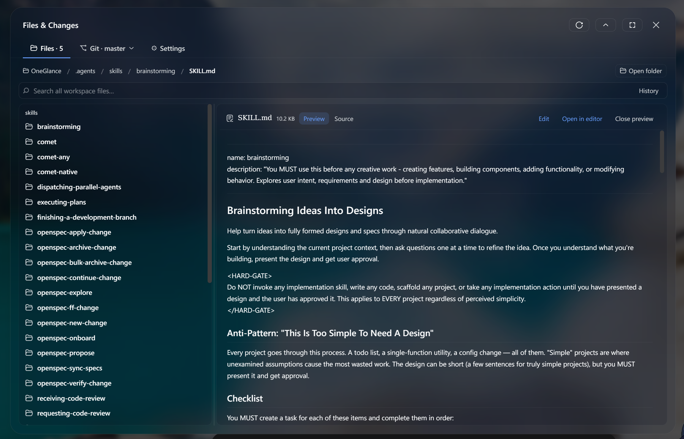
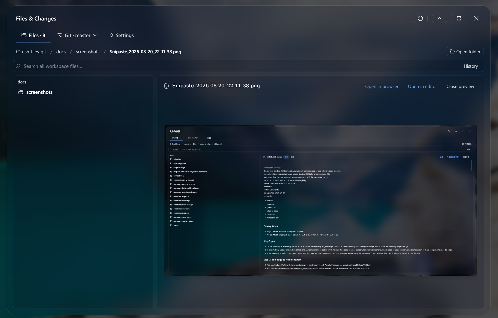
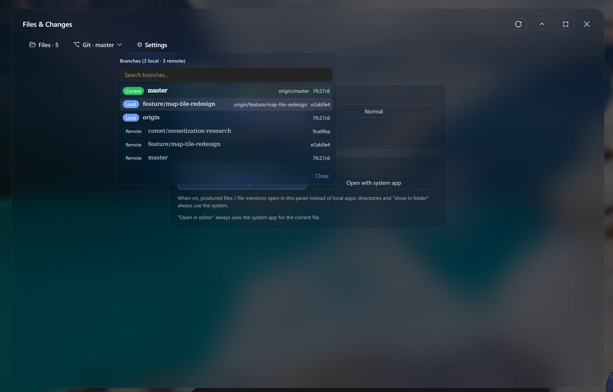

# dsh-files-git

[](LICENSE)
[](#installation)
[](#internationalization-i18n)

**English | [简体中文](README.md)**

A **Files & Changes** panel plugin for the DSH Web UI: an all-in-one
**file browser / search / preview / editor** plus **Git operations** (status,
staging, commit, pull, push, branches, history, diffs, …) for the current
session's workspace directory — rendered as a centered modal panel, so everyday
file and version-control work happens without ever leaving the WebUI.

- Zero runtime dependencies (the host half uses Node built-ins only) — installs offline;
- UI text follows the DSH language setting, with built-in **Chinese / English**;
- Security-conscientious: RPC is loopback-trusted only, file browsing is confined to the workspace root.


*The panel: file tree, search, and Markdown preview*

---

## Table of Contents

- [Features](#features)
- [Requirements](#requirements)
- [Installation (standard flow)](#installation-standard-flow)
- [Quick Start](#quick-start)
- [Configuration](#configuration)
- [Internationalization (i18n)](#internationalization-i18n)
- [Security Model](#security-model)
- [Development](#development)
- [Uninstall](#uninstall)
- [FAQ](#faq)
- [Contributing](#contributing)
- [License](#license)

## Features

### File browsing & preview

- **Lazy file tree**: expand/collapse directories with file sizes and Git status
  badges (staged / modified / untracked / conflicted);
- **Workspace-wide search**: git repositories are indexed via
  `git ls-files --cached --others --exclude-standard` (respects `.gitignore`);
  non-git directories fall back to filtering the current directory. Flat result
  list, double-click to preview (deep nested files included);
- **Search history**: keywords are recorded after a 1s pause (or Enter / blur);
  reopen from the dropdown and clear at will;
- **Content preview**: plain-text files render in full (no truncation under 512KB);
  a Preview/Source toggle renders Markdown and syntax-highlights code (chunked
  async rendering for large files — never blocks the main thread); files open
  in Source view by default;
- **In-panel editing**: a Monaco editor with automatic language matching,
  following the DSH light/dark theme; saving writes back to disk and refreshes
  Git status. The editor is hosted locally by the sidecar process
  (`/vendor/monaco` static assets) — no CDN, works offline; when Monaco is
  unavailable the view degrades to plain text and the "open in editor"
  fallback remains;
- **Quick actions**: hover any entry to **reveal in file explorer**, **copy path**,
  or **copy name**; breadcrumb segments are clickable, with a "Open directory"
  button on the far right.


*Image files preview inline, with open-in-browser / open-in-editor actions*

### Git operations

- **Info bar**: current branch, ahead/behind counts as high-contrast capsules (⬆ push / ⬇ pull);
- **Action bar**: pull (optional `--rebase`), push, fetch, force-push
  (`--force-with-lease`, double-confirmed); each action shows a live output
  module — progress while running, green on success, red on failure — kept
  until dismissed;
- **Branch selector**: all branches grouped current → local → remote (searchable);
  checkout / merge / create-from / update / rename;
- **Change list**: conflicted / staged / unstaged / untracked groups rendered as
  a directory tree (aggregated counts; whole-directory stage / unstage /
  untrack / track / ignore); untracked directories auto-expand into real file
  lists; per-file stage / unstage / add-to-`.gitignore`; type-colored status
  badges; **View all diffs** toggles between unstaged / staged;
- **Diff preview**: click a change row to expand its diff on the right
  (3:7 split, draggable divider, double-click to reset), word-level highlight
  (LCS) + line coloring with graceful degradation for huge diffs; untracked
  files render as all-green new-file diffs;
- **Commit**: commit selected / commit all, optional `--amend`, `Ctrl+Enter` shortcut;
- **History**: collapsed by default into an IDEA-style bar; expand into a
  scrollable list; click a commit for the **detail view** (changed files + diff,
  3:7 split); row menu offers **View changes** / **Revert commit** /
  **Reset to commit** (soft/hard — dangerous ops double-confirmed);
- **Auto refresh**: silent 5s polling (while the page is visible and idle),
  snapshot-deduped, external changes never interrupt your current operation.

### Panel experience

- **Modal panel**: same interaction as the settings dialog; header button for
  one-click fullscreen (fullscreen by default, configurable and persisted);
- **Suspend**: the "suspend" (↑) button — or moving the mouse out — slides the
  panel out of view, leaving a frosted handle at the top; hover to instantly
  restore the full state (tab, preview, scroll, search, git status). Only
  close (× / Esc) truly unmounts. The panel belongs to exactly one workspace
  at a time;
- **Artifact links → panel preview** (opt-in, off by default): when enabled,
  clicking produced-file chips / file mentions in the conversation previews
  them inside the panel instead of invoking a local app — in-workspace files
  navigate to their directory; out-of-workspace files preview read-only by
  absolute path (512KB cap);
- **Frosted-glass visuals**: panel at 86% base color + `blur(30px)`, popovers
  (search history, branch list, context menus) frosted too; theme-adaptive
  text colors stay legible in light/dark skins;
- **Focus trap & scroll lock**: Tab cycles inside the panel; wheel events don't
  leak through; while a popover is open only it scrolls;
- **Dual smart entry points**: once a session is engaged, the button sits in
  the header bar (left of "Session log"); on a brand-new workspace with no
  conversation yet (blank session) it automatically switches to a ghost button
  at the right end of the row above the composer — strictly synchronized with
  the header's visibility, never both at once.

### Performance

- Input isolation: typing a commit message re-renders only the commit box;
- Stable references + `React.memo`: `useGit` results, change rows, file rows,
  history blocks, diff cards and the panel shell compare by content — polling
  or a single checkbox rebuilds only the affected rows;
- Lazy loading: the Monaco editor loads from the sidecar's local
  `/vendor/monaco` route on first "Edit" click (no CDN involved);
- Highlight/Markdown results memoized per preview content — dragging dividers
  never re-runs them;
- Scroll isolation via `contain: content` on list/preview/diff containers;
- Host-side parallelized directory listing + browser RPC auto-retry
  (2 retries, 20s timeout).

## Requirements

| Dependency | Notes |
| --- | --- |
| [DSH](https://www.npmjs.com/package/@deepseek-ai/dsh) | `dsh web` (Web UI mode, `--profile web`) |
| Git | A `git` on `PATH` (or an absolute path via [configuration](#configuration)); 2.30+ recommended (`--force-with-lease` / `restore --staged`) |
| Browser | A modern Chromium / Firefox / Safari (the panel uses `backdrop-filter`, `color-mix`) |
| Network (optional) | Not required for in-panel editing — Monaco is served locally by the sidecar; CDN only benefits nothing here |

## Installation (standard flow)

### 1. Get the plugin

```sh
# Option 1: clone this repository
git clone https://github.com/leanderli/dsh-files-git.git
# Put it under the dsh plugins directory (any stable path works)
mkdir -p ~/.dsh/plugins
mv dsh-files-git ~/.dsh/plugins/
```

> On Windows `~` is `%USERPROFILE%` (e.g. `C:\Users\you\.dsh\plugins\dsh-files-git`).
> The path is an example — any directory that will **not be deleted or moved** works (see the warning below).

### 2. Register it into the web profile

```sh
dsh plugin --profile web add ~/.dsh/plugins/dsh-files-git
```

This appends `dsh-files-git` to `dsh.profile.bundles`; its `cordis.patch.yml`
(bundle patch) mounts the `files-git` plugin row on the next boot.

### 3. Restart dsh web

```sh
dsh web
```

### 4. Verify

1. Open the WebUI and enter (or create) any workspace session;
2. Engaged session → a **Files & Changes** button appears in the header bar,
   left of **Session log**;
3. Brand-new workspace without a conversation → a ghost button appears at the
   right end of the row above the composer;
4. Open the panel — the **Files** tab should list the current workspace; the
   **Git** tab activates inside git repositories.

> ⚠️ **Do not delete or move the plugin source directory after installation**:
> the profile stores a symlink (`link:absolute-path`); a missing source
> directory breaks `dsh web` startup. To uninstall use
> `dsh plugin --profile web remove dsh-files-git` — never just delete the directory.

## Quick Start

1. **Open the panel**: click **Files & Changes** (entry points above). The panel
   targets the current session's workspace directory automatically (no manual
   path) and follows session/workspace switches.
2. **Files tab**: click directories to expand; click files to preview; the
   preview header toggles Preview/Source, **Edit** (Monaco) and
   **Open in editor** (system default app); `.git` is hidden by default.
3. **Git tab**:
   - Stage: check change files (or directory rows / select-all) → Commit all / Commit selected;
   - Pull / Push / Fetch / Rebase: one click on the action bar, live output;
   - Diff: click a change row to expand; drag the divider;
   - History: click the collapsed bar → click a commit for details → row menu for revert/reset.
4. **Suspend**: click "↑" or move the mouse out to slide the panel away; hover
   the top handle to restore it instantly.

> Without a workspace the panel shows "no current workspace"; the Git tab
> hides itself in non-git directories.

## Configuration

Works out of the box. To override, patch the `files-git` row in the profile's
`cordis.patch.yml`:

```yaml
- id: files-git
  config:
    gitPath: /usr/bin/git        # absolute path to git (default: auto-resolved from PATH, skipping .git-ai dirs)
    defaultRoot: /path/to/repo   # fallback when the client sends no repo (rarely needed)
```

In-panel settings (⚙ settings tab, persisted in browser localStorage):

| Setting | Default | Description |
| --- | --- | --- |
| Open fullscreen by default | Fullscreen | Default panel size on open |
| Clicking produced files / file links | Off | Preview conversation artifacts inside the panel instead of opening the system app |


*The ⚙ settings tab, with the branch selector popover open*

## Internationalization (i18n)

- UI text **follows the DSH language setting** (Settings → General → Language);
  Chinese / English are built in and switch instantly (no refresh needed);
- Known boundary: host-side RPC error messages stay in Chinese (the host cannot
  sense the browser language); git command output is English / locale-mixed.

## Security Model

- **Loopback fence**: the `/git-api` channel is fenced by the DSH connection
  service's request rejection (`requestRejection`: Host/Origin trust + browser
  cookie auth) — the same trust fence as `/api`; only loopback origins
  (127.0.0.1 / localhost) may call it; LAN-origin requests are rejected;
- **Dedicated service fence**: git / file operations run in a separate service
  process bound to a random `127.0.0.1` port; every request must carry a
  random Bearer token (distributed through the loopback-fenced bootstrap
  channel `/git-api/service-info`; the runtime file lives under the user's
  home directory `~/.dsh-files-git/`, per-user isolated — never in a shared
  temp dir). Tokenless requests get 401. Direct-browser mode echoes CORS for
  loopback origins only; a LAN-served WebUI gets no CORS grant, falls back to
  the DSH proxy path and is rejected by the loopback fence (fail-closed);
- **Workspace confinement**: file browsing (`list` / `read` / the relative-path
  branch of `write`) is confined to the workspace root — `resolve` + `realpath`
  double containment checks reject `..`, absolute paths and symlink escapes;
- **No shell injection**: every git command runs via an argv array (never
  string-joined), so messages/paths cannot inject shell syntax;
- **Fail fast**: `GIT_TERMINAL_PROMPT=0` makes credential prompts fail fast
  instead of hanging; the Windows credential manager (GCM) still works;
- **Explicitly trusted exceptions**: `readPath` (absolute-path read-only, 512KB
  cap) and the `abs` branch of `write` are not workspace-constrained — they
  exist solely for files the panel has previewed/edited; the browser only ever
  sends back real paths it just read. See [SECURITY.md](SECURITY.md).

## Development

### Architecture

- **Host half** (`lib/index.js`): registers `POST /git-api/*` RPC endpoints
  over the shared `connection` channel; acts as **lifecycle manager + loopback
  proxy**: spawns / reuses the dedicated service process (singleton runtime
  file under `~/.dsh-files-git/` + health checks; automatic rotation on
  version/config change) and hands its port + token to the panel via
  `/git-api/service-info` (bootstrap for direct mode); zero runtime
  dependencies;
- **Service process** (`lib/server/server.js`): a standalone Node process
  (reusing DSH's Node binary) that actually runs git commands and file
  browsing — git never occupies the DSH main process's event loop; built-in
  concurrency caps, git process-tree management and a 30-minute idle
  self-exit; also serves `GET /events` SSE status push (debounced fs.watch +
  10s fallback polling, ≤4 concurrent streams) and the token-free loopback
  `/vendor/monaco` static route; zero runtime dependencies;
- **Browser half** (`lib/client.js`): a self-contained React panel registered
  into `conversation.session.header.utilities` (header button),
  `conversation.input.dock` (blank-session button) and `shell.overlay` (modal layer).
  Adaptive transport: with service-info it goes **direct** to the service
  (CORS allowlist of loopback origins only), otherwise it falls back to the
  DSH proxy path; status is SSE-driven with automatic polling fallback.

### Source layout

The dsh client module loader accepts exactly **one** bundle per plugin and its
`require` cannot resolve relative paths — so the source lives as readable
fragments under `lib/src/` (sharing one factory scope), stitched by the build
script:

```text
lib/
  client.js       ← shipped bundle (do not edit by hand; generated by build.cjs)
  build.cjs       ← assembler: node build.cjs (re-split current bundle + assemble)
                    node build.cjs --rebuild (assemble from src/ only)
  src/            ← source fragments (shared factory scope, dependency order)
    styles.js     CSS (DSH-token driven)
    icons.js      SVG icons
    store.js      overlay/hidden global state
    i18n.js       zh/en dictionaries (following the DSH locale)
    utils.js      RPC + shared UI atoms (btn/chip/lbtn/link/fmtSize)
    triggers.js   header button + blank-session ghost trigger
    hooks.js      useGit (state/actions/polling)
    diffutil.js   diff parsing + LCS word-level highlight
    monaco.js     Monaco editor (sidecar-hosted /vendor/monaco; shared by edit + diff)
    ui.js         memoized sub-views (change rows/history/diff panes)
    gitview.js    branch selector/confirm dialog/Git tab
    filebrowser.js file browser/search/preview/settings
    overlay.js    FilePanelBody + FilePanelOverlay (suspend/auto-suspend)
    index.js      apply()/inject entry
```

### Local workflow

```sh
git clone https://github.com/leanderli/dsh-files-git.git
cd dsh-files-git

# 1. Register into your local web profile via link (once)
dsh plugin --profile web add "$PWD"

# 2. Hack on lib/src/ fragments
# 3. Rebuild the shipped bundle
node lib/build.cjs --rebuild

# 4. Restart dsh web (client bundles load at startup)
dsh web
```

The `lib/client.js` bundle contains `#region` section comments for direct reading.

> ⚠️ Slot choice: the panel must **not** register into the `details` slot — that
> is a singleton slot owned by the built-in `dsh-client-ui-conversation` tool
> detail panel; a second entry throws and takes the whole Web client down. The
> panel uses `shell.overlay` (a list slot that allows multiple entries).

## Uninstall

```sh
dsh plugin --profile web remove dsh-files-git   # official way; never just delete the source directory
```

## FAQ

**Q: The button does nothing / the Web UI fails to start?**
Check whether the plugin source directory was moved or deleted (the profile
holds a symlink) and whether a singleton slot like `details` was used; roll
back with `dsh plugin --profile web remove dsh-files-git` before debugging.

**Q: Git commands randomly fail on Windows (exit code 0xC0000142)?**
A known Windows DLL-initialization hiccup under heavy git-process concurrency;
the host already retries once automatically. If it persists, pin `gitPath`
via [configuration](#configuration).

**Q: There is an extra node process in Task Manager / dsh-files-git-service-*.json files under ~/.dsh-files-git?**
Normal — the panel's git operations run in a dedicated service process (not on
the DSH main process), which self-exits after 30 minutes idle. The runtime file
and export cache live under `~/.dsh-files-git/` in the user home (no longer in
a shared temp dir). The file name embeds a config fingerprint (differently
configured DSH instances each get their own service). Deleting the file or
killing the process is safe: the panel respawns it on the next operation.

**Q: Git operations are rejected when the WebUI is accessed from another device on the LAN?**
Expected with the default bind (`--host 127.0.0.1`) — the `/git-api` trust
fence accepts loopback only. To use the panel over the LAN, use the official
DSH posture: `dsh --profile web --host 0.0.0.0`; the startup console prints a
token-bearing LAN URL, the first open exchanges it for a long-lived session
cookie, and the fence automatically trusts literal machine IPs (hostname
access additionally needs `--trusted-host`). The panel then switches to pure
proxy mode for non-loopback origins: git read/write fully work, status
refresh falls back to polling; the sidecar itself only ever binds the server
machine's loopback — its random port should not (and need not) be exposed.

**Q: Editing / the diff view fails to load?**
Both use the Monaco editor, hosted locally by the sidecar (`/vendor/monaco`,
token-free, loopback-only) — **offline works**, no CDN is involved. When
Monaco is unavailable (load failure, direct-mode restrictions on non-loopback
pages) the view degrades to plain text, and the "open in editor" fallback
remains. Binary files and read-truncated (>512KB) files are not editable.

## Contributing

Issues and PRs are welcome! See [CONTRIBUTING.md](CONTRIBUTING.md). For
security vulnerabilities please follow [SECURITY.md](SECURITY.md) instead of
opening a public issue.

## License

[MIT](LICENSE) © leanderli
